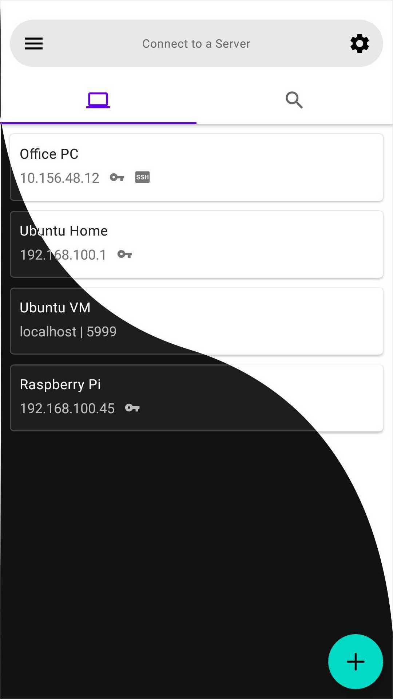
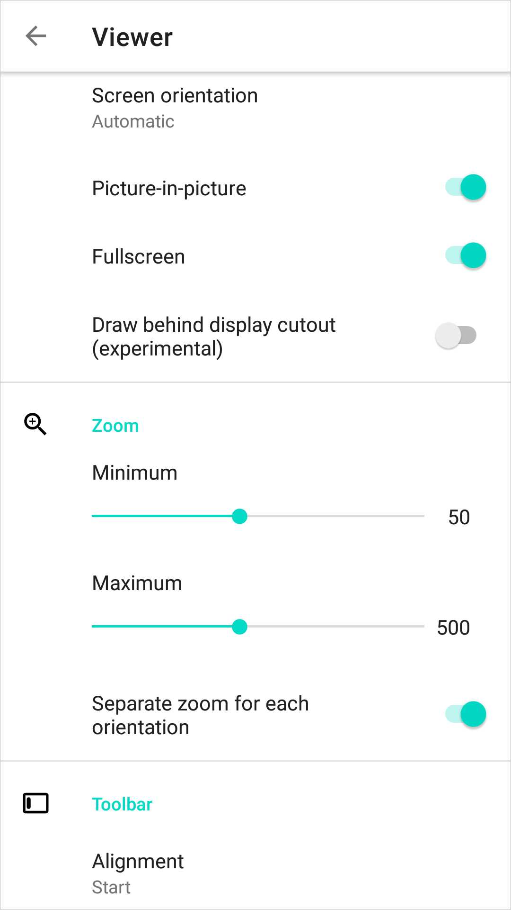
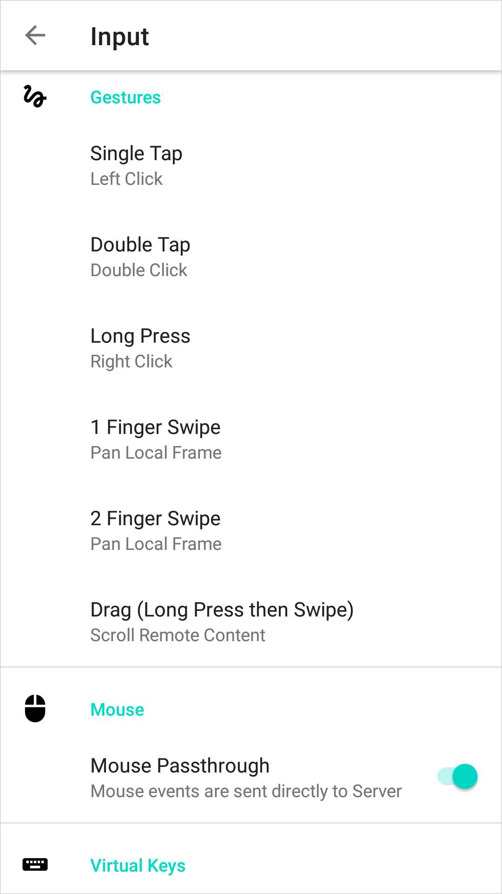
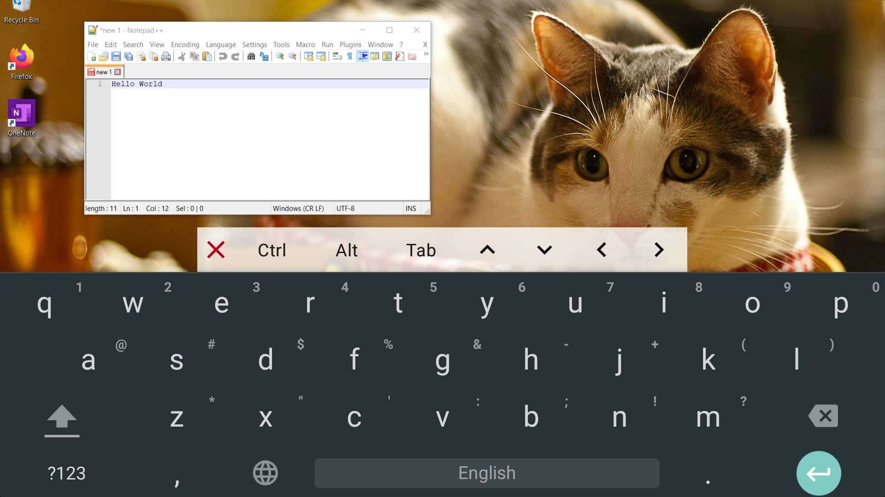

<p align="center"></img></a>


<p align="center"> <b>AVNC</b> is a VNC client for Android. </p>

-------------------------------------------------------------------------------


### Features
- Material Design (with Dark theme)
- Configurable gestures
- Tight encoding
- Virtual Keys
- Picture-in-Picture mode
- View-only mode
- Zeroconf Server Discovery
- TLS support (AnonTLS, VeNCrypt)
- SSH tunnel (VNC over SSH)
- Import/Export servers
- VNC Repeater support
- Clipboard Sync with server

[](https://f-droid.org/packages/com.gaurav.avnc/)

### Screenshots

[](metadata/en-US/images/phoneScreenshots/1.jpg)
[](metadata/en-US/images/phoneScreenshots/2.jpg)
[](metadata/en-US/images/phoneScreenshots/3.jpg)
[](metadata/en-US/images/phoneScreenshots/4.jpg)
[](metadata/en-US/images/phoneScreenshots/5.jpg)
[](metadata/en-US/images/phoneScreenshots/6.jpg)
[](metadata/en-US/images/phoneScreenshots/7.jpg)
[](metadata/en-US/images/phoneScreenshots/8.jpg)

  
Development
===========

Tools required:

- Git 
- Android Studio
- Android SDK
- NDK (with CMake)

To get started, simply clone the repo and initialize submodules:

```bash
git clone git@github.com:gujjwal00/avnc.git
cd avnc
git submodule update --init --depth 1
```

Now you can import the project in Android Studio, or build it directly from terminal.

Read [Architecture.kt](app/src/main/java/com/gaurav/avnc/Architecture.kt) (preferably in
Android Studio) to know more about the code.
